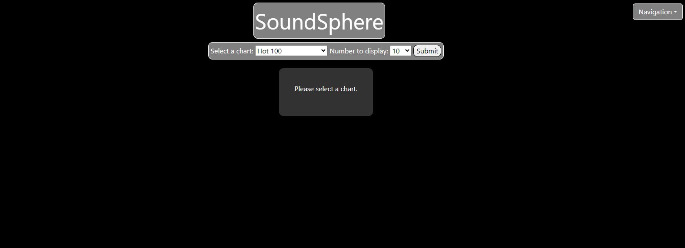

# soundsphere
Music app for finding new tracks, artists, and genres.

## Site Link
https://kyleh-git.github.io/soundsphere/

## Built With
HTML
CSS
JS

## Description

This site is a music lookup site to allow users to track the most popular music of the last week across the Billboard charts. It also allowed them to store songs to playlists on local storage, as well as lookup lyrics to any song on the lyrics page.

## Usage
On the homepage, select a Billboard chart and number of desired results to display the requested chart in the display below. Add songs to storage by clicking on the add song button below the chart rankings. On the Lyrics page of the site, users can search a song name to view the lyrics below. On the Playlist page songs saved from the homepage are displayed. You are able to create new playlists, and select a current playlist. After selecting a current playlist you can add songs from the saved song section to the current playlist by clicking the add song button.

## Contribution
Build help by:
- Igor @ https://github.com/HeDo6pIY
- Jay @ https://github.com/jaybow13

## Installation

N/A

## License
MIT License

Copyright (c) [2024] [Kyle Hayden]

Permission is hereby granted, free of charge, to any person obtaining a copy
of this software and associated documentation files (the "Software"), to deal
in the Software without restriction, including without limitation the rights
to use, copy, modify, merge, publish, distribute, sublicense, and/or sell
copies of the Software, and to permit persons to whom the Software is
furnished to do so, subject to the following conditions:

The above copyright notice and this permission notice shall be included in all
copies or substantial portions of the Software.

THE SOFTWARE IS PROVIDED "AS IS", WITHOUT WARRANTY OF ANY KIND, EXPRESS OR
IMPLIED, INCLUDING BUT NOT LIMITED TO THE WARRANTIES OF MERCHANTABILITY,
FITNESS FOR A PARTICULAR PURPOSE AND NONINFRINGEMENT. IN NO EVENT SHALL THE
AUTHORS OR COPYRIGHT HOLDERS BE LIABLE FOR ANY CLAIM, DAMAGES OR OTHER
LIABILITY, WHETHER IN AN ACTION OF CONTRACT, TORT OR OTHERWISE, ARISING FROM,
OUT OF OR IN CONNECTION WITH THE SOFTWARE OR THE USE OR OTHER DEALINGS IN THE
SOFTWARE.